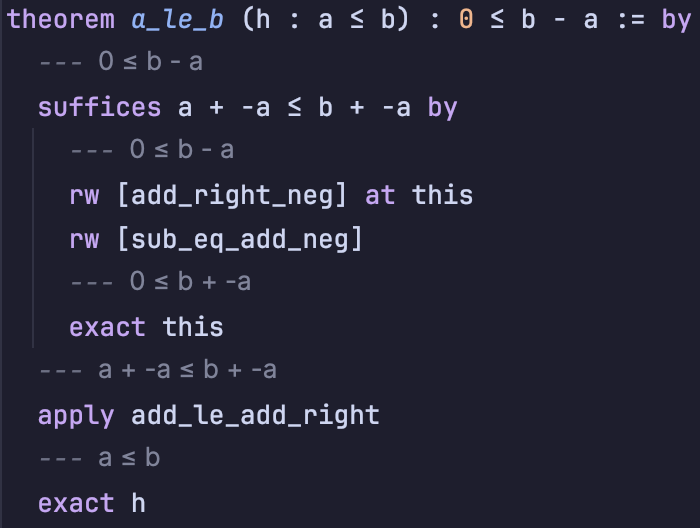
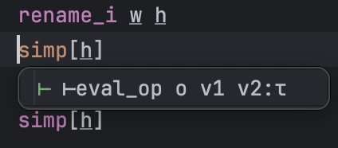

# Lean4ij

<!-- Plugin description -->
A [Lean4](https://lean-lang.org/) plugin for Jetbrains IDES with the following features:
- Interactive info view
- Inlay type and goal hints
- Autocompletion
- Unicode abbreviations
- Symbol Information
- Elan/Lake/Lean run configuration
- Project creation/management
- Recognize `lean` toolchain as SDK and `.lake` directory as library root

https://github.com/user-attachments/assets/25757345-0249-4999-adc7-7dadf94c8b0e

# Installation

First, [install Lean]( https://lean-lang.org/lean4/doc/setup.html)

Afterwards, you have two options for installing Lean4ij:
1. Using the IDE built-in plugin system (recommended): `Settings/Preferences` > `Plugins` > `Marketplace` > `Search for "lean4ij"` >
  `Install`. You can also download the beta versions by adding the beta channel `https://plugins.jetbrains.com/plugins/beta/list` to the plugin repository via `Manage Plugin Repositories...` in the setting options of the plugin page.
2. Manually: Download the [latest release](https://github.com/onriv/lean4ij/releases/latest) and install it
  using
  `Settings/Preferences` > `Plugins` > `⚙️` > `Install plugin from disk...` For nightly builds go
  to [Actions/build](https://github.com/onriv/lean4ij/actions/workflows/build.yml), find the latest successful run and
  scroll to the bottom.

## Usage

1. Create a new lean project using `lake new example`. Then, open the project in IntelliJ (or any other Jetbrains IDE with the lean4ij plugin).
   - Verify the toolchain by running `lake exe cache get` in the project directory
2. Unicode is supported via live templates, for example typing `\b1<SPACE>` would result in `𝟙`.
3. To display the infoview, open any lean file and click the `∀` at the top toolbar. Otherwise, open find action (Control Shift A) and search for `Lean4 Actions: toggle lean infoview (internal) toolbar visibility`
   - If the infoview or anything else seems to be misbehaving, try clicking the restart button at the top of the infoview
4. Enable goal hints by pressing Control I on the line that you want to see the goal for (Control Shift I to remove). You will see something like this:
   - 
5. Toggle a mini infoview that follows your cursor by pressing `Control '`. Use `Control '` to disable
    - 

### Actions

Currently, the following actions are defined, mostly without default shortcut. Add one for them in `Keymap` (like
`Control Shift Enter` for toggle infoview)

| action id                            | action text                                                 | default shortcut |
|--------------------------------------|-------------------------------------------------------------|------------------|
| ToggleLeanInfoViewInternal           | Lean4 Actions: Toggle Infoview (internal)                   |                  |  
| ToggleLeanInfoViewJcef               | Lean4 Actions: Toggle Infoview (jcef)                       |                  |  
| IncreaseZoomLevelForLeanInfoViewJcef | Lean4 Actions: Increase zoom level for lean infoview (jcef) |                  |  
| DecreaseZoomLevelForLeanInfoViewJcef | Lean4 Actions: Decrease zoom level for lean infoview (jcef) |                  |  
| ResetZoomLevelForLeanInfoViewJcef    | Lean4 Actions: Reset zoom level for lean infoview (jcef)    |                  |  
| OpenExternalInfoviewInBrowser        | Lean4 Actions: Open infoview in browser                     |                  |  
| RestartLeanLsp                       | Lean4 Actions: Restart Lean Lsp Server                      |                  |  
| RestartCurrentLeanFile               | Lean4 Actions: Restart Current Lean File                    |                  |  
| RestartJcefInfoview                  | Lean4 Actions: Restart Jcef Infoview                        |                  |  
| AddInlayGoalHint                     | Lean4 Actions: Add Inlay Goal Hint                          | Control I        |  
| DelInlayGoalHint                     | Lean4 Actions: Delete Inlay Goal Hint                       | Control Shift I  |  
| ToggleMiniInfoView                   | Lean4 Actions: Toggle Mini Infoview                         | Control '         |  

## Settings

Since version 0.0.17 there are some settings available:

- General setting is under `Settings/Preferences` > `Leanguages & Frameworks` > `Lean4`. Available settings are:
    - (TODO) Enable Lsp Completion: Currently not support, waiting lsp4ij's new release. This is for currently
      discovering that sometimes lsp completion is slow. But it's enable by default.
- Enable the native infoview, and timeout for popping the doc
- Enable the external infoview
- Extra css for external infoview. The most relevant I found is changing font-size

The inlay hints related settings are under `Settings/Preferences` > `Inlay Hints` > `textmate`:

- `Show inlay hint for omit type`
- `Show value for placeholder _`

Some color settings are under `Settings/Preferences` > `Editor` > `Color Scheme` >  `Lean Infoview`. It contains color
settings for both the external and internal infoview.

<!-- Plugin description end -->

## Development

Please check [DEVELOP.md](./DEVELOP.md).

## Known Issues

The plugin is still on an early stage, check [ISSUES.md](./ISSUES.md) for known and logged issues,
and [TODO.md](./TODO.md)

## Troubleshooting

- Currently, the plugin seems capable to open the same project with vscode in the same time (Although it may consume
  twice the cpu and memory resources). Try open the project simultaneously in VSC and JB-IDE while troubleshooting.
- Currently, some log is printed in the build window for the progressing file and the url to the external/jcef infoview,
  if something does not work normally, some log there may help.
- There are also detailed logs for the lsp server supported by LSP4IJ via the "language servers" tool window after
  setting the debug/trace level to verbose.
- Some logs are also sent in the standard log file like `idea.log`. For different systems the path of it's the following
  paths, it can also be opened via `Help/Show log in ...` in the menu.
    - (Linux) `$HOME.cache/JetBrains/<Product>/log/idea.log`
    - (Windows) `$HOME\AppData\Local\JetBrains\<Product>\log\idea.log`
    - (Macos) `~/Library/Caches/<Product>/log/idea.log`
- If the IDE is freezing, try check also the `threadDumps-freeze-***` files under the log folder.

For showing debug/trace log, add `lean4ij:all` in `MENU > Help > Diagnostic Tools > Debug Log Settings` and restart,
see [How-to-enable-debug-logging-in-IntelliJ-IDEA](https://youtrack.jetbrains.com/articles/SUPPORT-A-43/How-to-enable-debug-logging-in-IntelliJ-IDEA)
for more docs.

## Acknowledgments

The following projects give great help for developing the plugin:

- [leanprover/vscode-lean4](https://github.com/leanprover/vscode-lean4)
- [leanprover-community/lean4web](https://github.com/leanprover-community/lean4web)
- [Julian/lean.nvim](https://github.com/Julian/lean.nvim)
- [leanprover-community/lean4-mode](https://github.com/leanprover-community/lean4-mode)
- [redhat-developer/lsp4ij](https://github.com/redhat-developer/lsp4ij)

and many source codes with references to

- [intellij-arend](https://github.com/JetBrains/intellij-arend)
- [intellij-haskell](https://github.com/rikvdkleij/intellij-haskell.git)
- [julia-intellij](https://github.com/JuliaEditorSupport/julia-intellij)
- [intellij-quarkus](https://github.com/redhat-developer/intellij-quarkus/)
- [intellij-rust](https://github.com/intellij-rust/intellij-rust.git)
- [intellij-sdk-code-samples](https://github.com/JetBrains/intellij-sdk-code-samples)

Plugin based on the [IntelliJ Platform Plugin Template][template].

[template]: https://github.com/JetBrains/intellij-platform-plugin-template

[docs:plugin-description]: https://plugins.jetbrains.com/docs/intellij/plugin-user-experience.html#plugin-description-and-presentation
